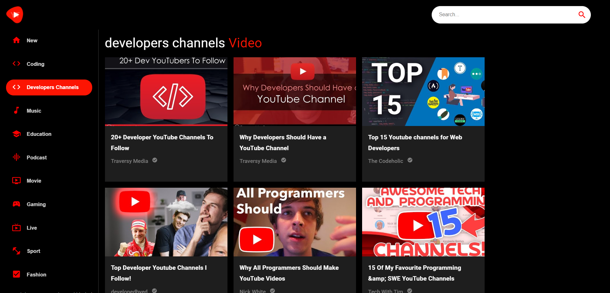

# YouTube Clone

Welcome to my YouTube clone project! This is a ReactJS-based web application that allows users to search for and watch videos. The app is designed to be responsive on all screen sizes, and uses Material UI and Material Icons for styling.

## Features:
- Search for videos: Users can enter search terms and see a list of videos that match their query.
- Watch videos: Users can click on a video from the search results to watch it.
- Material UI and Material Icons: The app uses Material UI and Material Icons to provide a consistent and modern design.
- Responsive design: The app is designed to look and work great on all screen sizes.

## Technologies Used:
This project was built using:
- ReactJS: A JavaScript library for building user interfaces.
- Material UI: A set of React components that implement Google's Material Design.
- Material Icons: A set of icons that follow Google's Material Design guidelines.
- React Router: A library for handling routing in React applications.
- React Player: A lightweight, customizable video player for React applications.
- RapidAPI for get the Data
- Axios: A library for making HTTP requests from the browser.

## Installation

- Clone the repository to your local machine.

- Install the dependencies using npm install.

- Start the development server using npm start.

- Navigate to http://localhost:3000 in your web browser to view the app.


```bash
  npm install 
  cd my-project
```

## Screenshots




## 🚀 About Me
Mohamed Khaled is a skilled front-end developer specializing in React JS and is passionate about creating responsive and dynamic user interfaces. With a strong background in web development and a wealth of experience working on a range of projects, I bring a proven track record of delivering high-quality work and exceeding client expectations.

Throughout my career, I have honed my skills in various areas, including React JS, JavaScript, HTML, CSS, and other web development technologies. I pride myself on my ability to create intuitive, user-friendly designs that prioritize the user experience and seamlessly integrate with backend systems.

Some of the technologies and tools I'm proficient in include:

- React JS (including Redux Toolkit, React Router, and Next.js)
- JavaScript (ES6+) and TypeScript
- HTML5, CSS3 (including CSS preprocessors such as Tailwind CSS)
- Responsive web design and mobile-first development
- Git and GitHub
- Testing frameworks such as Jest

My portfolio includes several notable projects demonstrating my technical expertise and creative problem-solving abilities. Whether working independently or as part of a team, I am committed to delivering results that meet or exceed client expectations, on time and within budget.

If you are looking for a skilled front-end developer with expertise in React JS, look no further. Contact me today to discuss your project and discover how I can help bring your vision to life.


## 🔗 Links
[](https://www.linkedin.com/in/mohamed-developer/)


 